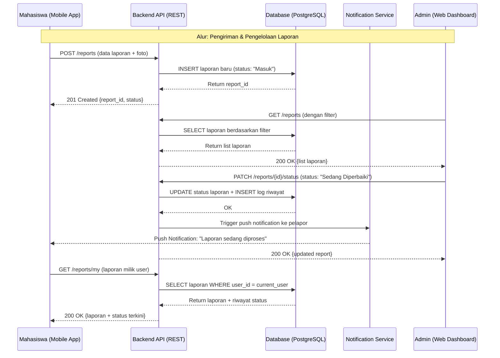
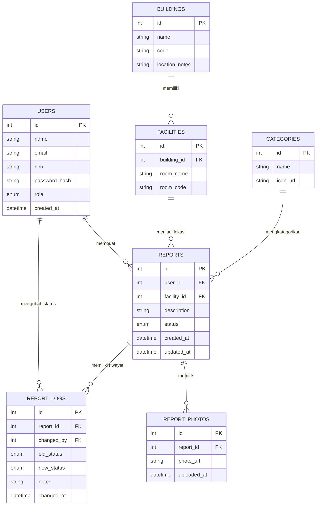

# PRD — CampusFix: Sistem Pelaporan Kerusakan Fasilitas Kampus

---

## 1. Overview

Di lingkungan kampus, kerusakan fasilitas seperti lampu mati, kursi patah, proyektor tidak berfungsi, atau AC bermasalah adalah hal yang sangat umum terjadi. Kondisi ini secara langsung mengganggu kenyamanan dan efektivitas kegiatan belajar mengajar. Sayangnya, hingga saat ini belum ada mekanisme pelaporan yang terstruktur — laporan biasanya disampaikan secara lisan, melalui pesan pribadi, atau bahkan tidak dilaporkan sama sekali karena mahasiswa tidak tahu harus melapor ke mana.

CampusFix hadir sebagai solusi digital untuk menjembatani mahasiswa, staf kampus, dan petugas fasilitas dalam satu platform terintegrasi. Mahasiswa dapat melaporkan kerusakan langsung melalui aplikasi mobile dengan disertai foto dan lokasi, sementara petugas fasilitas dapat memantau dan mengelola seluruh laporan melalui dashboard web yang terpusat.

Tujuan utama sistem ini adalah: (1) mempercepat proses pelaporan kerusakan, (2) memastikan setiap laporan tercatat secara resmi dan tidak terlewat, (3) memberikan transparansi kepada pelapor melalui pembaruan status laporan secara real-time, dan (4) membantu manajemen kampus menganalisis kondisi fasilitas secara data-driven.

Pengguna sistem ini terdiri dari tiga kelompok utama: **Mahasiswa** sebagai pelapor utama melalui aplikasi mobile, **Dosen/Staf Kampus** yang dapat membantu melaporkan atau memverifikasi kerusakan, serta **Admin/Petugas Fasilitas** yang mengelola laporan dan memperbarui status perbaikan melalui aplikasi web.

---

## 2. Requirements

Berikut adalah persyaratan tingkat tinggi untuk pengembangan sistem CampusFix:

- **Aksesibilitas:** Aplikasi mobile harus dapat diakses di platform Android dan iOS. Dashboard web harus responsif dan dapat diakses melalui browser modern tanpa instalasi tambahan.
- **Autentikasi Pengguna:** Setiap pengguna wajib login menggunakan akun yang terdaftar (email/NIM kampus). Role pengguna (mahasiswa, staf, admin) menentukan hak akses fitur dalam sistem.
- **Input Data Laporan:** Pengguna harus dapat mengisi detail laporan minimal mencakup: kategori fasilitas, deskripsi kerusakan, lokasi (gedung/ruangan), dan foto kerusakan (opsional namun direkomendasikan).
- **Manajemen Status Laporan:** Admin dapat mengubah status laporan melalui alur: *Masuk → Diverifikasi → Sedang Diperbaiki → Selesai → Ditolak*. Setiap perubahan status tersimpan dalam log riwayat.
- **Notifikasi:** Sistem mengirimkan notifikasi push (mobile) dan/atau email kepada pelapor setiap kali status laporan berubah.
- **Keamanan Data:** Semua komunikasi antara client dan server menggunakan HTTPS/TLS. Data pengguna dan laporan disimpan secara terenkripsi. Akses admin dibatasi dengan autentikasi berbasis token (JWT).
- **Dokumentasi Laporan:** Setiap laporan memiliki ID unik, timestamp, dan riwayat perubahan status yang dapat ditelusuri oleh mahasiswa maupun admin.
- **Skalabilitas Awal:** Sistem dirancang untuk mendukung hingga 1.000 pengguna aktif dan 500 laporan per bulan pada tahap awal deployment.

---

## 3. Core Features

Fitur-fitur kunci yang harus ada dalam versi pertama (MVP):

1. **Autentikasi & Manajemen Akun**
   - Login menggunakan email/NIM dan password
   - Registrasi akun baru dengan verifikasi email kampus
   - Role-based access control: Mahasiswa, Staf, Admin

2. **Formulir Pelaporan Kerusakan (Mobile)**
   - Pilih kategori fasilitas (Listrik, Furnitur, Elektronik, Sanitasi, dll.)
   - Input lokasi: pilih gedung dan nomor ruangan dari daftar dropdown
   - Isi deskripsi kerusakan secara singkat dan jelas
   - Unggah foto kerusakan (maks. 3 foto, format JPG/PNG)
   - Submit laporan dengan konfirmasi

3. **Pelacakan Status Laporan (Mobile)**
   - Halaman "Laporan Saya" menampilkan daftar laporan yang pernah dibuat
   - Detail laporan mencakup status terkini, riwayat status, dan catatan dari admin
   - Indikator visual status (badge warna) untuk memudahkan pemahaman

4. **Dashboard Admin (Web)**
   - Tabel laporan masuk dengan filter berdasarkan status, kategori, lokasi, dan tanggal
   - Detail laporan lengkap dengan foto terlampir
   - Tombol aksi untuk memperbarui status laporan dan menambahkan catatan tindakan
   - Tampilan ringkasan statistik: total laporan, laporan pending, laporan selesai

5. **Sistem Notifikasi**
   - Notifikasi push ke aplikasi mobile saat status laporan berubah
   - Opsional: notifikasi email sebagai fallback

6. **Manajemen Data Fasilitas (Admin)**
   - CRUD data gedung dan ruangan kampus
   - Kategori fasilitas yang dapat dikonfigurasi oleh admin

---

## 4. User Flow

Alur kerja end-to-end pengguna dalam menggunakan sistem CampusFix:

1. **Registrasi & Login:** Mahasiswa mengunduh aplikasi mobile, mendaftar menggunakan email kampus, dan login ke dalam sistem.

2. **Menemukan Kerusakan:** Mahasiswa menemukan fasilitas kampus yang rusak (misalnya, proyektor di ruang kelas tidak berfungsi).

3. **Membuat Laporan:** Mahasiswa membuka menu "Buat Laporan", memilih kategori dan lokasi fasilitas, mengisi deskripsi kerusakan, mengunggah foto, lalu menekan tombol "Kirim Laporan".

4. **Konfirmasi Laporan Terkirim:** Sistem menampilkan notifikasi sukses beserta ID laporan yang dapat digunakan untuk pelacakan.

5. **Admin Menerima Laporan:** Petugas fasilitas membuka dashboard web, melihat laporan baru masuk, dan memverifikasi kelengkapan laporan.

6. **Proses Tindak Lanjut:** Admin memperbarui status laporan menjadi "Sedang Diperbaiki" dan menambahkan catatan estimasi waktu perbaikan.

7. **Mahasiswa Menerima Notifikasi:** Aplikasi mobile mengirimkan push notification kepada mahasiswa bahwa laporan sedang dalam proses perbaikan.

8. **Penyelesaian Laporan:** Setelah perbaikan selesai, admin mengubah status menjadi "Selesai" disertai catatan hasil tindakan.

9. **Mahasiswa Memverifikasi:** Mahasiswa menerima notifikasi "Selesai" dan dapat melihat riwayat laporan di halaman "Laporan Saya".

---

## 5. Architecture

Berikut adalah gambaran arsitektur sistem dan aliran data utama CampusFix:

---

## 6. Database Schema

Berikut adalah Entity Relationship Diagram (ERD) sistem CampusFix:

| Tabel | Deskripsi |
|-------|-----------|
| **USERS** | Menyimpan data semua pengguna: mahasiswa, staf, dan admin beserta role-nya |
| **REPORTS** | Inti sistem — menyimpan setiap laporan kerusakan yang dikirim oleh pengguna |
| **REPORT_PHOTOS** | Menyimpan URL foto yang diunggah sebagai lampiran laporan |
| **REPORT_LOGS** | Mencatat riwayat perubahan status laporan beserta catatan tindakan admin |
| **FACILITIES** | Data ruangan/fasilitas yang ada di kampus, berelasi ke gedung |
| **BUILDINGS** | Data gedung kampus sebagai referensi lokasi laporan |
| **CATEGORIES** | Kategori jenis kerusakan (Listrik, Furnitur, Elektronik, Sanitasi, dll.) |

---

## 7. Design & Technical Constraints

Bagian ini mengatur batasan teknis dan panduan desain sistem CampusFix:

1. **High-Level Technology Stack:**
   - **Mobile (Frontend):** Flutter (Dart) — dipilih karena dapat dikompilasi ke Android dan iOS dari satu codebase, ideal untuk tim kecil 4 orang.
   - **Web Dashboard (Frontend):** React.js + Tailwind CSS — ekosistem yang mature, banyak referensi, dan mudah dipelajari dalam satu semester.
   - **Backend:** Node.js + Express.js dengan arsitektur REST API — ringan, cepat di-setup, dan mudah di-deploy.
   - **Database:** PostgreSQL — relasional, mendukung query kompleks untuk filtering laporan di dashboard admin.
   - **File Storage:** Cloudinary atau Supabase Storage untuk penyimpanan foto laporan.
   - **Push Notification:** Firebase Cloud Messaging (FCM) untuk notifikasi mobile.
   - **Deployment:** Backend di Railway atau Render (gratis tier); Database di Supabase atau Railway.

2. **Typography Rules:**
   - **Sans (UI Utama):** `'Plus Jakarta Sans', 'DM Sans', sans-serif`
   - **Serif (Aksen/Heading besar):** `'Lora', 'Merriweather', serif`
   - **Mono (Kode/ID Laporan):** `'JetBrains Mono', 'Fira Code', monospace`

3. **Non-Functional Requirements:**
   - **Performa:** Response time API ≤ 500ms untuk operasi CRUD standar. Upload foto menggunakan kompresi client-side sebelum dikirim ke server (maks. 1MB per foto setelah kompresi).
   - **Keamanan:** Autentikasi menggunakan JWT dengan masa berlaku 7 hari. Password di-hash menggunakan bcrypt. Semua endpoint dilindungi middleware autentikasi kecuali login dan registrasi. Upload file divalidasi tipe MIME-nya di server.
   - **Skalabilitas:** Sistem dirancang untuk menangani 1.000 pengguna aktif dan ~500 laporan/bulan. Struktur database menggunakan indexing pada kolom `user_id`, `status`, dan `created_at` untuk performa query dashboard.
   - **Maintainability:** Kode backend menggunakan struktur MVC (Model-View-Controller). Setiap modul frontend dikerjakan secara modular agar memudahkan pembagian kerja tim 4 orang.

---

## Pembagian Modul Frontend (4 Anggota Tim)

Mengingat tim terdiri dari 4 orang dengan pendekatan modul UI:

| Anggota | Modul | Halaman yang Dikerjakan |
|---------|-------|------------------------|
| **Anggota 1** | Autentikasi & Profil | Login, Register, Halaman Profil Pengguna |
| **Anggota 2** | Pelaporan (Mobile) | Form Buat Laporan, Konfirmasi Laporan, Upload Foto |
| **Anggota 3** | Tracking Laporan (Mobile) | Halaman "Laporan Saya", Detail Laporan, Riwayat Status |
| **Anggota 4** | Dashboard Admin (Web) | Tabel Laporan, Filter & Search, Update Status, Statistik |

---

## Asumsi & Catatan

- Sistem ini diasumsikan digunakan dalam lingkungan kampus tunggal (satu institusi), bukan multi-tenant.
- Registrasi pengguna diasumsikan menggunakan verifikasi email dengan domain kampus (misal: `@student.kampus.ac.id`), namun jika tidak memungkinkan, verifikasi manual oleh admin juga bisa diterapkan.
- Fitur peta lokasi fasilitas tidak termasuk dalam MVP dan akan dikembangkan di fase berikutnya.
- Fitur statistik di dashboard admin ditampilkan dalam bentuk card ringkasan sederhana (bukan chart interaktif) untuk MVP.
- Diasumsikan petugas fasilitas memiliki akses laptop/komputer untuk menggunakan dashboard web.
- Bagian yang memerlukan klarifikasi lebih lanjut: mekanisme verifikasi akun mahasiswa (apakah pakai SSO kampus, email domain, atau manual approval admin).
