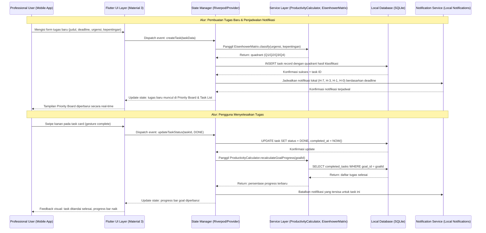
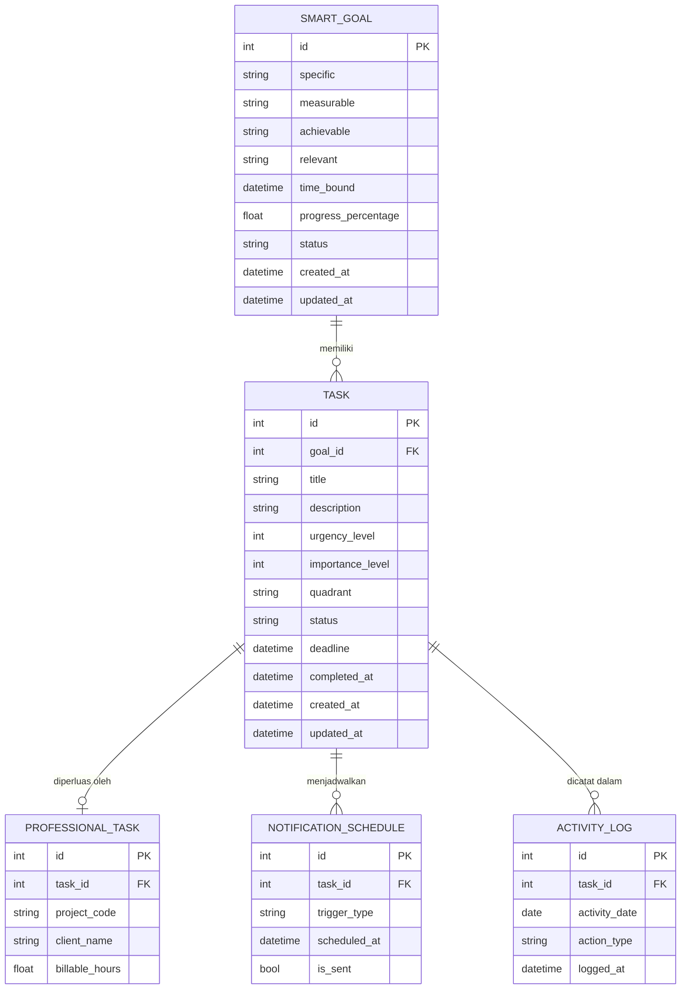

# PRD — FocusFlow: Intelligent Task & Productivity Management System

## 1. Overview

Di era kerja hybrid dan remote yang semakin mendominasi lanskap profesional modern, para pekerja pengetahuan (*knowledge workers*) dihadapkan pada tantangan serius: **task overflow** — ledakan tugas yang datang dari berbagai platform komunikasi tanpa sistem prioritas yang jelas. Rata-rata pekerja menghabiskan hingga 28% waktu kerjanya hanya untuk mengelola email dan mencari informasi, alih-alih fokus pada pekerjaan bernilai tinggi. Akibatnya, burnout, missed deadlines, dan penurunan kualitas output menjadi konsekuensi yang tak terhindarkan.

**FocusFlow** hadir sebagai solusi aplikasi mobile produktivitas kelas enterprise yang dirancang khusus untuk profesional, freelancer, tim startup, dan knowledge workers. Aplikasi ini bukan sekadar to-do list biasa — melainkan sebuah **sistem manajemen tugas berbasis metodologi ilmiah** yang menggabungkan dua framework terbukti: **S.M.A.R.T Goal Framework** untuk penetapan tujuan yang terukur, dan **Eisenhower Matrix** untuk prioritisasi tugas berbasis urgensi dan kepentingan.

Tujuan utama FocusFlow adalah menjadi *"Single Source of Truth"* bagi produktivitas individu — memaksa pengguna untuk berhenti sejenak, mendefinisikan tujuan secara jernih, lalu mengeksekusi tugas berdasarkan prioritas objektif, bukan reaksi emosional terhadap notifikasi. Visi jangka panjangnya adalah menjadi aplikasi manajemen tugas pribadi terdepan yang membantu profesional mencapai *peak performance* melalui desain minimalis dan metodologi yang telah teruji.

Pengembangan dimulai dengan **Fase 1 (MVP Frontend-First)** menggunakan Flutter sebagai platform cross-platform (Android & iOS), dengan arsitektur *local-first* menggunakan SQLite — memastikan aplikasi berfungsi 100% tanpa koneksi internet. Pendekatan ini memungkinkan validasi UX sejak dini sebelum investasi infrastruktur backend cloud pada Fase 2.

---

## 2. Requirements

Berikut adalah persyaratan tingkat tinggi untuk pengembangan sistem:

- **Aksesibilitas & Offline-First:** Aplikasi harus berfungsi sepenuhnya tanpa koneksi internet menggunakan SQLite sebagai penyimpanan lokal, memastikan aksesibilitas kapan saja dan di mana saja tanpa ketergantungan pada server.
- **Pengguna Tunggal (Single-Role):** Fase 1 hanya mendukung satu role pengguna yaitu *The Busy Professional* (usia 22–45 tahun), dengan antarmuka yang dirancang untuk penggunaan individu, bukan kolaborasi tim.
- **Onboarding Terstruktur:** Pengguna wajib menyelesaikan proses penetapan S.M.A.R.T Goal sebelum dapat mengakses fitur inti lainnya, memastikan setiap tugas memiliki konteks tujuan yang jelas.
- **Input & Manajemen Data Tugas:** Sistem harus mendukung pembuatan, pembacaan, pembaruan, dan penghapusan (CRUD) tugas dengan atribut lengkap seperti judul, deskripsi, deadline, tingkat urgensi, dan tingkat kepentingan, serta status tracking bertahap (TODO → IN_PROGRESS → REVIEW → DONE).
- **Notifikasi Lokal Multi-Level:** Sistem wajib mengimplementasikan pengingat lokal bertahap untuk setiap tugas pada interval H-7, H-3, H-1, dan H-0 (hari-H deadline) tanpa memerlukan koneksi internet.
- **Keamanan Data Lokal:** Data pengguna disimpan secara lokal dengan enkripsi dasar menggunakan SQLite; kode dibangun dengan prinsip OOP yang ketat (Encapsulation, Abstraction, Inheritance, Polymorphism) untuk memudahkan migrasi aman ke backend cloud di Fase 2.
- **Performa & Responsivitas UI:** Antarmuka harus responsif dengan waktu transisi antar layar di bawah 300ms, mendukung gestur swipe (kanan untuk complete, kiri untuk delete/archive), dan drag-and-drop antar kuadran Eisenhower.
- **Skalabilitas Arsitektur:** Kode harus mengikuti prinsip arsitektur clean code berbasis OOP sehingga modul dapat dimigrasi ke backend Node.js/Spring Boot + PostgreSQL pada Fase 2 tanpa refaktor besar.

---

## 3. Core Features

Fitur-fitur kunci yang harus ada dalam versi pertama (MVP):

1. **S.M.A.R.T Goal Onboarding Wizard**
   - Wizard 5 langkah interaktif untuk mendefinisikan tujuan berdasarkan kriteria: Specific, Measurable, Achievable, Relevant, dan Time-Bound.
   - Pengguna tidak dapat mengakses fitur utama lain sebelum menyelesaikan wizard ini untuk pertama kali.
   - Menghasilkan *Goal Card* permanen yang ditampilkan di Home Dashboard sebagai acuan utama keberhasilan seluruh tugas.
   - Mendukung pembuatan dan pengeditan goal baru untuk periode berikutnya.

2. **Eisenhower Matrix Priority Board**
   - Tampilan visual 4 kuadran interaktif: Q1 (Do It Now — Urgent & Important), Q2 (Schedule — Not Urgent & Important), Q3 (Delegate — Urgent & Not Important), Q4 (Drop — Not Urgent & Not Important).
   - Fitur drag-and-drop untuk memindahkan tugas antar kuadran secara real-time.
   - Toggle switch sebagai alternatif drag-and-drop untuk aksesibilitas yang lebih baik.
   - Deteksi klasifikasi kuadran otomatis berdasarkan atribut urgensi dan kepentingan yang diinput pengguna.

3. **Smart Task Manager (CRUD Engine)**
   - Form pembuatan tugas cerdas dengan deteksi kuadran otomatis berdasarkan input urgensi dan kepentingan.
   - Status tracking alur kerja profesional: TODO → IN_PROGRESS → REVIEW → DONE.
   - Dukungan swipe gesture: swipe kanan untuk menyelesaikan tugas, swipe kiri untuk menghapus atau mengarsipkan.
   - Fitur pencarian dan filter tugas berdasarkan kuadran, status, dan deadline.

4. **Multi-Level Local Notifications**
   - Sistem pengingat lokal bertahap otomatis: H-7 (7 hari sebelum deadline), H-3, H-1, dan H-0 (hari deadline).
   - Notifikasi berjalan sepenuhnya secara lokal tanpa memerlukan koneksi internet.
   - Pengguna dapat mengonfigurasi pengaktifan/penonaktifan notifikasi per tugas.

5. **Productivity Analytics Dashboard**
   - Goal Progress Bar: persentase pencapaian tujuan S.M.A.R.T berdasarkan jumlah tugas yang diselesaikan.
   - Activity Heatmap: visualisasi konsistensi kerja harian mirip GitHub contribution graph.
   - Quadrant Distribution Chart: analisis apakah pengguna terlalu banyak berada di Q3/Q4 atau sudah fokus di Q2.
   - Weekly Report: ringkasan otomatis pencapaian mingguan yang dapat ditinjau pengguna.

6. **Home Dashboard (Command Center)**
   - Ringkasan harian: jumlah tugas aktif, tugas hari ini, dan progres goal utama.
   - Goal Card permanen yang menampilkan tujuan S.M.A.R.T aktif beserta persentase pencapaiannya.
   - Quick-add shortcut untuk membuat tugas baru langsung dari Home tanpa berpindah layar.
   - Navigasi utama via Bottom Navigation Bar dengan 4 tab: Home, Priority Board, Task Manager, Analytics.

---

## 4. User Flow

Alur kerja sederhana bagi pengguna saat menggunakan aplikasi:

1. **Instalasi & Launch:** Pengguna mengunduh dan membuka aplikasi FocusFlow untuk pertama kali; sistem menampilkan layar sambutan (splash screen) dengan branding Nexus Digital Solutions.
2. **S.M.A.R.T Onboarding (First-Time Only):** Pengguna diarahkan ke wizard 5 langkah untuk menetapkan satu tujuan utama periode ini — mengisi Specific, Measurable, Achievable, Relevant, dan Time-Bound. Wizard tidak dapat dilewati pada sesi pertama.
3. **Home Dashboard:** Setelah wizard selesai, pengguna masuk ke Home Dashboard yang menampilkan Goal Card aktif, ringkasan tugas hari ini, dan quick-add shortcut.
4. **Pembuatan Tugas Baru:** Pengguna menekan tombol quick-add atau membuka tab Task Manager → mengisi form tugas (judul, deskripsi, deadline, tingkat urgensi, tingkat kepentingan) → sistem secara otomatis mengklasifikasikan tugas ke kuadran Eisenhower yang tepat.
5. **Prioritisasi di Priority Board:** Pengguna membuka tab Priority Board → melihat semua tugas terdistribusi di 4 kuadran → melakukan drag-and-drop atau menggunakan toggle untuk memindahkan tugas antar kuadran sesuai dengan perubahan konteks.
6. **Eksekusi & Status Update:** Pengguna membuka detail tugas dari Task Manager atau Priority Board → mengubah status dari TODO menjadi IN_PROGRESS → saat tugas selesai, melakukan swipe kanan atau mengubah status ke DONE.
7. **Penerimaan Notifikasi:** Pada interval yang ditentukan (H-7, H-3, H-1, H-0), sistem mengirimkan notifikasi lokal sebagai pengingat deadline tugas kepada pengguna.
8. **Evaluasi Mingguan via Analytics:** Pengguna membuka tab Analytics → meninjau heatmap aktivitas, distribusi kuadran, goal progress bar, dan weekly report → menggunakan insight ini untuk menyesuaikan strategi kerja minggu berikutnya.
9. **Update Goal (Periodik):** Setelah satu periode tujuan berakhir atau diselesaikan, pengguna dapat membuat goal baru melalui wizard S.M.A.R.T → siklus produktivitas dimulai kembali dari langkah 3.

---

## 5. Architecture

Berikut adalah gambaran arsitektur sistem dan aliran data pada Fase 1 (Frontend-First, Local Storage):

---

## 6. Database Schema

Berikut adalah Entity Relationship Diagram (ERD) untuk Fase 1:

| Tabel | Deskripsi |
|-------|-----------|
| **SMART_GOAL** | Menyimpan satu tujuan utama pengguna per periode dengan 5 atribut S.M.A.R.T dan persentase progress terkini. |
| **TASK** | Tabel inti untuk semua tugas dengan atribut urgensi, kepentingan, kuadran Eisenhower, status alur kerja, dan deadline. |
| **PROFESSIONAL_TASK** | Ekstensi opsional dari TASK untuk menambahkan atribut profesional seperti kode proyek, nama klien, dan jam billable. |
| **NOTIFICATION_SCHEDULE** | Menyimpan jadwal notifikasi lokal per tugas (H-7, H-3, H-1, H-0) beserta status pengiriman. |
| **ACTIVITY_LOG** | Mencatat seluruh aktivitas tugas per hari untuk menghasilkan data heatmap pada Analytics Dashboard. |

---

## 7. Design & Technical Constraints

Bagian ini mengatur batasan teknis dan panduan desain yang harus diikuti seluruh tim pengembang:

1. **High-Level Technology Stack:**
   Fase 1 menggunakan **Flutter** sebagai framework utama untuk mendukung cross-platform Android dan iOS dari satu codebase, mengurangi overhead pengembangan dan memastikan konsistensi UI. State management menggunakan **Riverpod** atau **Provider** karena keduanya mendukung reactive programming yang diperlukan untuk pembaruan UI real-time pada Priority Board. Penyimpanan lokal menggunakan **SQLite** via package `sqflite` untuk data tugas yang kompleks dan relasional, serta **SharedPreferences** untuk pengaturan pengguna yang sederhana (preferensi tema, notifikasi). Notifikasi lokal menggunakan package `flutter_local_notifications`. Seluruh kode mengikuti prinsip OOP ketat (SmartGoal dengan Encapsulation, Task sebagai Abstract Class, ProfessionalTask dengan Inheritance, EisenhowerMatrix dengan Polymorphism) untuk mempersiapkan migrasi mulus ke **Node.js/Spring Boot + PostgreSQL + JWT Auth** pada Fase 2.

2. **Typography Rules:**
   - **Sans (Primary):** `Inter, Roboto, -apple-system, BlinkMacSystemFont, sans-serif` — digunakan untuk body text, label, dan elemen UI.
   - **Serif (Accent):** `Georgia, 'Times New Roman', serif` — digunakan secara terbatas untuk judul editorial atau heading dekoratif.
   - **Mono (Code/Data):** `'Roboto Mono', 'Courier New', monospace` — digunakan untuk nilai numerik pada Analytics Dashboard, kode proyek, dan timestamp.

3. **Non-Functional Requirements:**
   - **Performa:** Waktu transisi antar layar di bawah 300ms; operasi CRUD database harus selesai dalam waktu di bawah 100ms pada perangkat mid-range; aplikasi harus dapat dijalankan pada perangkat Android dengan RAM 2GB dan iOS dengan spesifikasi setara.
   - **Keamanan:** Data lokal disimpan di direktori privat aplikasi yang tidak dapat diakses aplikasi lain; tidak ada data sensitif yang dikirimkan ke server eksternal pada Fase 1; kode dibangun dengan separation of concerns untuk mencegah bocornya logika bisnis ke layer UI.
   - **Skalabilitas:** Arsitektur Fase 1 dirancang untuk menampung hingga 500 tugas dan 50 goals aktif per pengguna tanpa degradasi performa; struktur OOP memungkinkan penambahan modul baru (kolaborasi tim, cloud sync, AI suggestions) tanpa refaktor besar pada Fase 2.
   - **Desain Visual:** Menggunakan **Material 3 Design System** dengan tema korporat — warna primer Navy (`#1B2A5E`) dan aksen Red (`#D32F2F`); mendukung Dark Mode dan Light Mode; seluruh komponen mengikuti aksesibilitas WCAG 2.1 Level AA (contrast ratio minimal 4.5:1 untuk teks normal).

---

## Asumsi & Catatan

- Fase 1 tidak mencakup fitur autentikasi pengguna (login/register) karena bersifat single-user local storage; mock auth flow hanya dibangun sebagai placeholder untuk Fase 2.
- Diasumsikan satu pengguna hanya memiliki satu S.M.A.R.T Goal aktif dalam satu waktu; fitur multiple concurrent goals baru akan dipertimbangkan di Fase 2.
- Fitur "Delegate" pada Q3 Eisenhower Matrix pada Fase 1 hanya bersifat label — belum ada integrasi dengan aplikasi komunikasi (Slack, email) untuk mendelegasikan tugas ke orang lain.
- Weekly Report diasumsikan berbasis data lokal saja dan tidak dapat diekspor (export ke PDF/email dijadwalkan untuk Fase 2).
- Billable hours pada ProfessionalTask tidak terhitung otomatis — pengguna mengisi secara manual; timer otomatis adalah kandidat fitur Fase 2.
- Bagian yang memerlukan klarifikasi lebih lanjut: mekanisme backup data lokal (apakah ada export manual?), batas maksimum notifikasi yang dapat dijadwalkan oleh OS Android/iOS secara bersamaan, dan apakah streak/gamifikasi akan masuk dalam scope MVP atau Fase 2.
